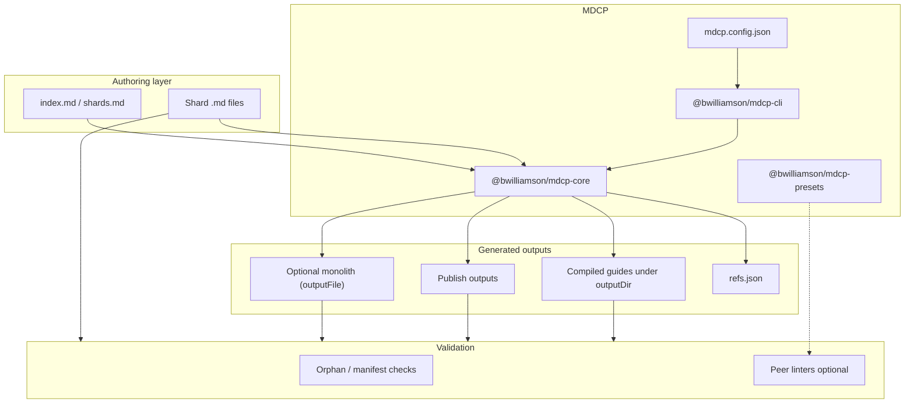

# Overview

**mdcp** ([MarkDown Context Protocol](../glossary/mdcp.md)) helps teams maintain large documentation in **small shard files**, **compile them into canonical outputs**, and **validate before merge**. It is built for LLM-assisted authoring, human review, and compiled output for agents and end-user readers.

This page is the **mental model** for the whole system. Use it to orient yourself before diving into command details, API modules, or config fields.

## What problem it solves

Large Markdown guides are hard to edit, diff, and link correctly. A single `README.md` or `guides.md` with dozens of headings invites merge conflicts, broken cross-references, and orphan sections that no longer appear in the table of contents.

MDCP inverts the workflow:

1. **Authors edit shards**: one file per section, listed in the [manifest](../glossary/manifest.md) (`index.md` or `shards.md`) of their [guide](../glossary/guide.md).
2. **Compile stitches shards**: it normalizes heading levels, strips preambles, and rewrites links.
3. **Validation catches drift**: [orphans](../glossary/orphan.md), stale refs, broken internal links, optional prose/style linters.
4. **Compiled output serves consumers**: compiled guides (some as [publish outputs](../glossary/publish-output.md)) and the optional [monolith](../glossary/monolith.md).

You never hand-maintain the compiled file. Shards are the source of truth. Each [compiled guide](../glossary/compiled-guide.md) is generated, whether it is `{name}.md` under `outputDir` or a publish output such as `README.md`.

## Core vocabulary

The glossary defines the core terms:

- [Shard](../glossary/shard.md): one `.md` file that becomes part of a guide (such as `01-intro.md`).
- [Guide](../glossary/guide.md): a directory of shards plus a manifest, named in `compileOrder`.
- [Compiled guide](../glossary/compiled-guide.md): the file compile writes for one guide.
- [Publish output](../glossary/publish-output.md): a compiled guide at its own `compile.outputFile`, such as a package README.
- [Monolith](../glossary/monolith.md): the optional single file that stitches the guides without `compile.outputFile`.
- [Refs registry](../glossary/refs-registry.md): GitHub-style heading slugs from compile output.

Paths and config: shards live under the docs root (`--docs-root`), one subdirectory per guide. Generated paths are relative to `outputDir`, which defaults to `_build` and is safe to delete. `--config` resolves from the directory you run the command in, not from the docs root ([`--config` vs `--docs-root`](../client-cli/config-essentials.md#--config-vs---docs-root)). [Path layout](../client-cli/config-essentials.md#path-layout) in Config essentials has every other path rule and default, and `loadConfig(path, configBase)` in the [config API](../client-core/api-config.md) follows the same rules.

## How the pieces fit together



| Package                         | Role                                                                                      |
| ------------------------------- | ----------------------------------------------------------------------------------------- |
| **`@bwilliamson/mdcp-cli`**     | Command-line entry point: `compile`, `check`, `shard`, `refs`, peer linter wrappers.      |
| **`@bwilliamson/mdcp-core`**    | Library implementation: compile/assemble, refs, validation, shard orchestration, hooks.   |
| **`@bwilliamson/mdcp-presets`** | Starter markdownlint configs and the `MDCP` Vale style (opt-in via config / `.vale.ini`). |

The CLI is a thin wrapper over core. Integrators (CI, editors, agents) can call core directly or shell out to the CLI.

## The pipeline in order

Understanding this sequence explains why most commands exist:

```text
  [optional] mdcp shard          Split a source document into guide shards (md-tree)
           ↓
  Edit shards + index.md
           ↓
  mdcp compile                 Assemble outputs, rewrite links, write refs.json
           ↓
  mdcp check                   Orphans → compile → refs → links → linters → paths → coverage
```

**Split** (`mdcp shard`) is the inverse path. Use it to bootstrap shards from an existing source document, not on every edit cycle.

## What compile actually does

For each guide in `compileOrder`, core:

1. **Reads section files**: from link order in the manifest (`index.md` / `shards.md`). See [Manifest compile order](./manifest-compile-order.md) when the manifest mixes preamble example links with a `## Sections` list (`compile.sectionsHeading`).
2. **Transforms each shard**: demotes headings to fit the guide level; strips `about-this-guide` preamble; runs **compile hooks** (`stripAnchors`, `codeEvidence`, `inlineInserts`) by default. See [Default compile hooks](./default-compile-hooks.md). Cross-guide link rewrite runs at assembly. See [Cross-guide link rewriting](../client-core/compile-hooks/cross-guide-links.md).
3. **Assembles the guide body**: injects optional `compile.title` as a `##` heading followed by a blank line, then concatenates sections in order. When the first shard’s top heading matches the title, that duplicate heading is stripped.
4. **Rewrites links**: the [link passes](../client-core/compile-hooks/index.md#link-passes) turn a shard's links to other shards into `#slug` targets, in the same document or in another output. They rewrite a `./` or `../` link to any indexed shard, and a bare link to a shard the guide stitches. A link to a guide that `compile.crossGuideLinks.ignoreGuides` names keeps its shard path instead. The passes then rebase the shard's other `../` paths relative to the guide's [link base](../client-core/compile-hooks/publish-relative-links.md#when-it-runs), except the ones [Publish-relative exclusions](../client-core/compile-hooks/publish-relative-links.md#publish-relative-exclusions) lists, such as a path that leads to no file.
5. **Marks broken links and re-aligns tables**: by default, a [BROKEN LINK marker](./link-validation.md#broken-link-marker) replaces each `#fragment` link that matches no heading or section slug in the compiled guide. A link to a missing file stays a link, and link lint reports it. Then core re-aligns each aligned table whose links changed width. See [Tables after link rewriting](../client-core/compile-hooks/index.md#tables-after-link-rewriting).
6. **Writes outputs**: one [compiled guide](../glossary/compiled-guide.md) per guide (at `compile.outputFile` or the default path), plus the [monolith](../glossary/monolith.md) when top-level `outputFile` is set and at least one guide has no `compile.outputFile`.

Guides with `compile.outputFile` are **excluded from the monolith** so you can publish npm READMEs, `DEVELOPERS.md`, or compiled review guides side by side.

## What validation checks

`mdcp check` runs a fixed core pipeline, then optional peer tools:

| Stage          | Module                   | Catches                                                      |
| -------------- | ------------------------ | ------------------------------------------------------------ |
| Orphans        | `validate/orphans.ts`    | Shard/manifest mismatches                                    |
| Compile        | `compile/`               | Assembly failures                                            |
| Refs           | `refs/registry.ts`       | Stale `refs.json`                                            |
| Built-in links | `links/`                 | Broken links and fragments in shards and compiled output     |
| Linters        | `peers/` + host install  | markdownlint, Vale, link-check when configured               |
| Paths          | `validate/path-probe.ts` | Backtick paths in prose that don't resolve, when enabled     |
| Coverage       | `validate/coverage.ts`   | Markdown files no guide captures (fatal under `scan.strict`) |

Peer linters are **not bundled**. CI uses `--require-lint` / `--require-vale` to fail when tools are missing.

## Config as the wiring layer

`mdcp.config.json` is the single contract between your repo layout and every command:

- **`compileOrder`**: which guides exist and in what order they appear in the monolith.
- **`guides[].compile`**: per-guide manifest name, hooks, publish path, title, scope root, etc.
- **`outputFile`**: optional monolith path.
- **`refs`**: registry file path and slug algorithm.
- **`lint` / `vale`**: peer linter config paths and scan globs.

This repository uses MDCP on its own docs under `docs/`. The features guide compiles to `docs/_build/features.md` and is the only guide in the monolith `docs/_build/guides.md`. The other guides compile to publish outputs such as `DEVELOPERS.md` and the package READMEs. See `docs/mdcp.config.json` for a multi-output layout.

## Where to go next

- **Commands and priority tiers**: the [Feature catalog](./feature-catalog.md) and [Personas and priority tiers](./personas-and-priority-tiers.md)
- **Who runs which command**: the [Actors and obligations](./protocol/usage-model.md#actors-and-obligations) table in the usage model
- **Intentional limits**: the [Design constraints](./design-constraints/index.md), each with a one-line summary
- **Install and daily commands**: the [Client CLI guide](../client-cli/index.md)
- **Programmatic API**: the [Client core guide](../client-core/index.md)
- **Config fields**: the [config API](../client-core/api-config.md)
- **Compile hooks**: the [Compile hooks overview](../client-core/compile-hooks/index.md)
- **Contributing to this repo**: the [Developer guide](../developer/index.md)
- **Performance SLOs at scale**: the [Performance goals](./protocol/performance.md) page
- **A publish landing example**: this repository compiles its root `README.md` from [`docs/repo-readme/`](../repo-readme/index.md). Its copy follows the [Publish landing style](./personas-and-priority-tiers.md#publish-landing-style) and the claim tiers in [Benefit claims and evidence](./protocol/benefit-claims-and-evidence.md)
